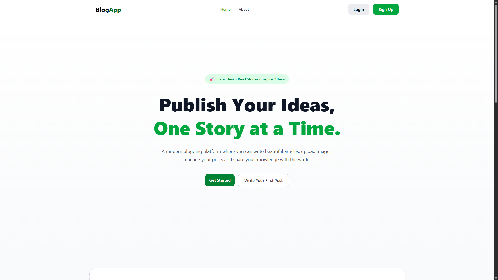
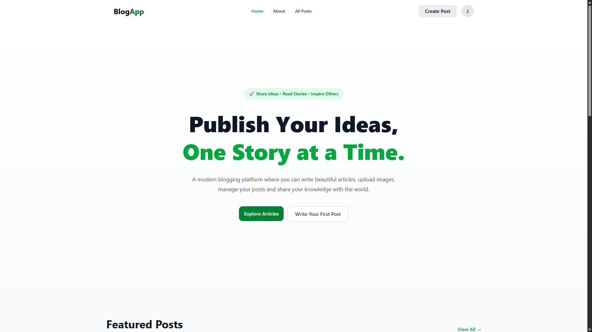
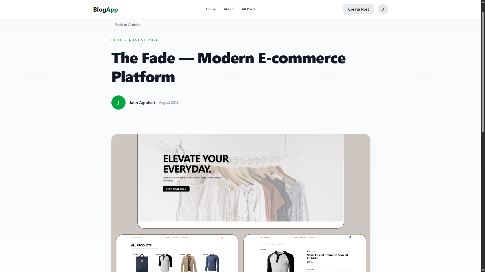
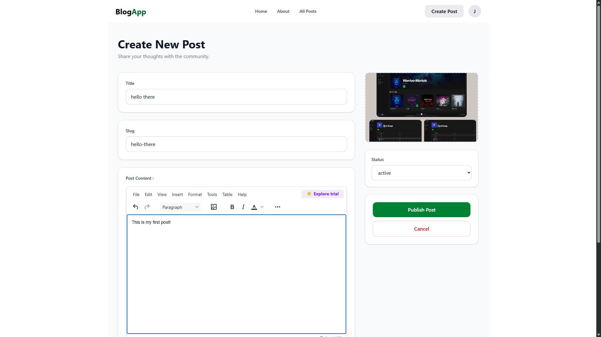
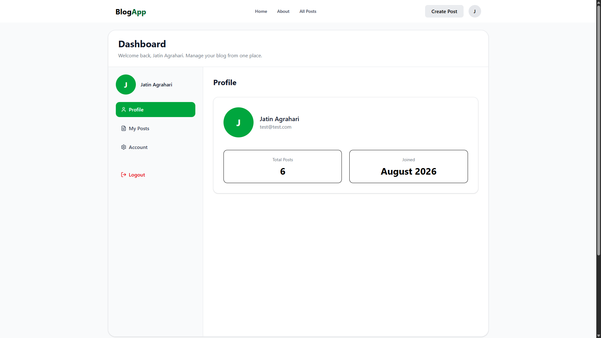
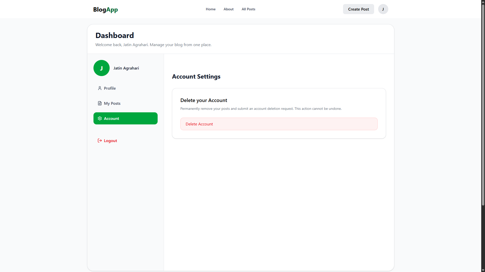

# ✨ BlogApp

A modern full-stack blogging platform built with **React**, **Redux Toolkit**, **Appwrite**, and **Tailwind CSS**. BlogApp allows users to create an account, publish articles with a rich text editor, upload images, manage their own posts, and explore content shared by other users through a clean, responsive interface.

---

[](https://your-blog-app.vercel.app)
[](https://react.dev/)
[](https://appwrite.io/)
[](https://tailwindcss.com/)

## 📸 Preview

| Home                      | After Login              |
| ------------------------- | ------------------------ |
|  |  |
| Blog                      | Create Blog              |
|   |  |
| Dashboard                 | Account Deletion         |
|   |  |

---

## 🌐 Live Demo

🔗 **Live Website:** https://appblogstack.netlify.app

Experience the application without any setup. Create an account, publish articles, manage posts, and explore the full blogging platform.

---

## 🚀 Features

### Authentication

- Secure user authentication with Appwrite
- Login & Registration
- Protected routes
- Persistent user sessions

### Blog Management

- Create new posts
- Edit existing posts
- Delete posts
- Rich text editor (TinyMCE)
- Automatic slug generation
- Featured image upload
- Post status management

### User Dashboard

- Personal profile
- View your published posts
- Account management
- Delete account request
- Author-only post management

### Content

- Featured posts section
- All articles page
- Individual article pages
- Responsive card layout
- Author information
- Tags support

### UI / UX

- Responsive design
- Modern minimal interface
- Loading states
- Mobile navigation
- Clean typography
- Smooth interactions

---

# 🛠 Tech Stack

### Frontend

- React
- React Router DOM
- Redux Toolkit
- React Hook Form
- Tailwind CSS
- TinyMCE

### Backend

- Appwrite Authentication
- Appwrite Database
- Appwrite Storage

---

# 📂 Folder Structure

```
src
│
├── appwrite
├── components
├── pages
├── store
├── conf
├── assets
└── data
```

---

# 📄 Pages

- Home
- About
- All Posts
- Single Post
- Create Post
- Edit Post
- Login
- Signup
- User Dashboard

---

# 📱 Responsive

- Desktop
- Tablet
- Mobile

---

# ⭐ Future Improvements

- Search functionality
- Categories
- Comments
- Likes & Bookmarks
- User profile editing
- Pagination
- Dark mode
- Toast notifications
- Loading skeletons

---

# 👨‍💻 Author

**Jatin Agrahari**

If you enjoyed this project, consider giving it a ⭐ on GitHub.
